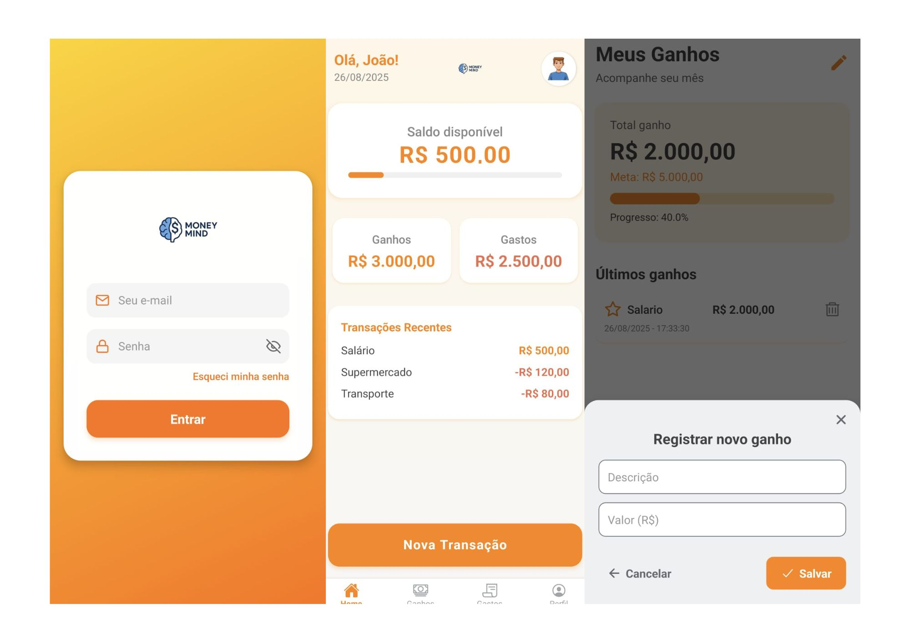

# 💰 MoneyMind - Gestão Financeira Mobile Full Stack

O **MoneyMind** é uma solução completa para gestão financeira pessoal. Diferente de aplicativos básicos, o MoneyMind utiliza uma arquitetura robusta de micro-serviços simulada por uma API segura e um frontend mobile de alta performance, focado em visualização de dados e segurança do usuário.

---

## 📱 Visual do Aplicativo
> 

---

## 🛠️ Stack Tecnológica

### **Frontend Mobile**
* **Framework:** React Native 0.79 & Expo 53 (SDK mais recente).
* **Navegação:** Estrutura híbrida com **Expo Router**, Stack e Bottom Tabs.
* **Visualização de Dados:** Gráficos interativos com `react-native-chart-kit` e indicadores de progresso com `react-native-progress`.
* **UX Premium:** Efeitos de desfoque (`expo-blur`), feedback tátil (`expo-haptics`) e animações fluidas com `reanimated`.
* **Integração:** Comunicação assíncrona com API via **Axios** e persistência local com **Async Storage**.

### **Backend**
* **Engine:** Java 17 com Spring Boot 3.4.2.
* **Segurança:** Autenticação Stateless via **JWT (JJWT 0.11.5)** e **Spring Security**.
* **Banco de Dados:** PostgreSQL para persistência de dados relacionais.
* **Qualidade de Código:** Uso intensivo de **Lombok** para código limpo e padronização de DTOs.

---

## 🏗️ Arquitetura e Fluxo de Dados

1.  **Segurança:** O usuário realiza o login e recebe um Token JWT assinado.
2.  **Persistência:** O token é armazenado com `Async Storage` para sessões persistentes.
3.  **Visualização:** O App consome os endpoints de transações e transforma os dados brutos em gráficos visuais no Dashboard.
4.  **Backend:** Valida cada requisição via filtros do Spring Security antes de acessar o repositório JPA.

---

## 🚀 Como Executar

### Backend
1. Certifique-se de ter o **Java 17** instalado.
2. Configure seu `application.properties` com as credenciais do PostgreSQL.
3. Execute: `./mvnw spring-boot:run`

### Mobile
1. Instale as dependências: `npm install`
2. Inicie o Expo: `npx expo start`
3. Escaneie o QR Code com o app **Expo Go** no Android ou iOS.

---

## 👤 Desenvolvedor
**Leonardo Schaffer Mota**
* [LinkedIn](https://www.linkedin.com/in/leoschaffermota/)
* [GitHub](https://github.com/leolsm12)

---
*Este projeto faz parte do meu portfólio de Engenharia de Software, demonstrando habilidades em desenvolvimento Full Stack, Segurança da Informação e UI/UX Mobile.*